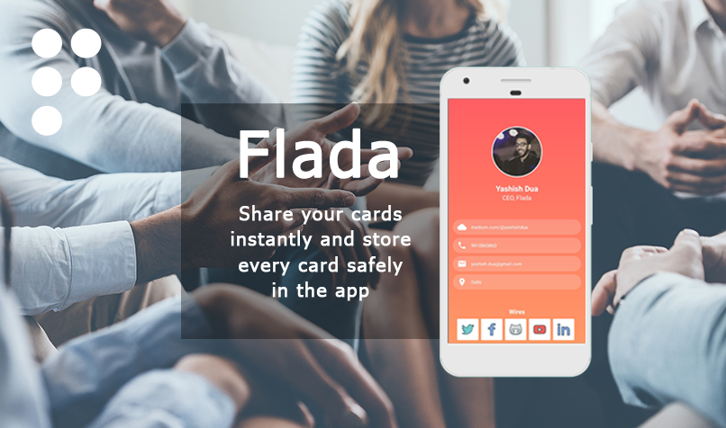
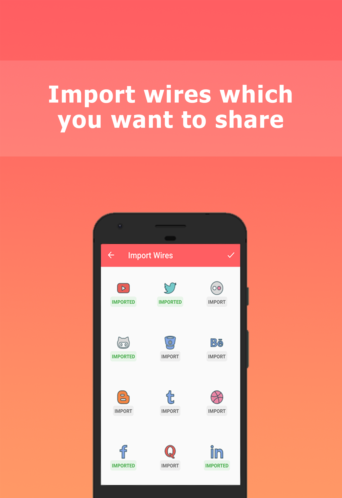
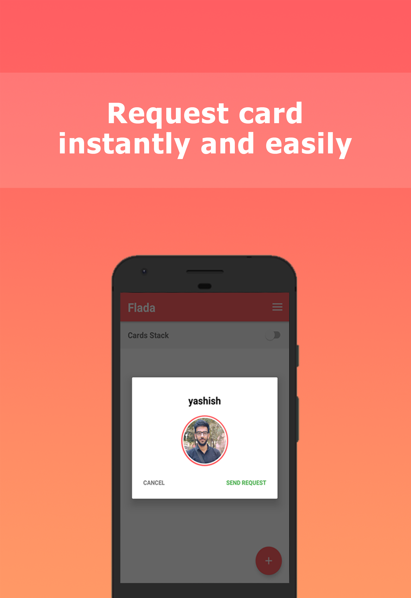
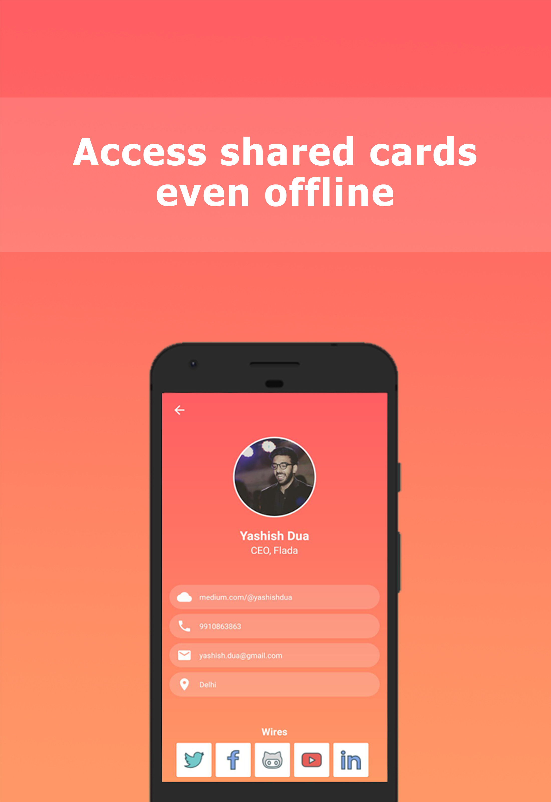

# Flada: Add on to your meetings

Flada allows creating your own personal cards which contains all your social media and professional data that you want to share.

To keep your meetings simple and interactive, Flada helps you share your professional information instantly. It also saves shared cards making the collection of your network easy and accessible.

### Show some :heart: and star the repo to support the project
     

# Screenshots

  

# How Flada works?

+ Set up your profile and import all social media profiles which you want to share in a meeting.
+ Rather sharing information verbally in meetings you can simply give your username to the other person. He/She then can request your card.
+ Share your card instantly!
+ Best part, these cards are saved offline.

# Download the app now!
https://play.google.com/store/apps/details?id=com.company.devorbs.flada
